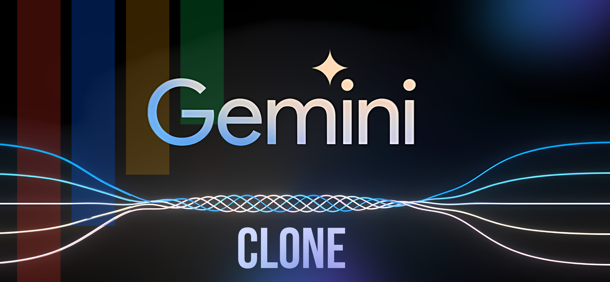

# Gemini Clone Assignment – Kuvaka Tech



A fully functional, responsive, and visually appealing frontend for a Gemini-style conversational AI chat application. Built as part of the Kuvaka Tech assignment by Binu Baiju.

## Table of Contents

- [Overview](#overview)
- [Live Demo](#live-demo)
- [Features](#features)
- [Technology Stack](#technology-stack)
- [Setup & Run Instructions](#setup--run-instructions)
- [Folder & Component Structure](#folder--component-structure)
- [Implementation Details](#implementation-details)
- [Screenshots](#screenshots)

## Overview

This project simulates a Gemini-style conversational AI chat app with OTP-based authentication, per-user chat isolation, chatroom management, AI messaging, image uploads, and modern UX/UI features. **All data is managed client-side using Zustand and localStorage. No backend is used.**

## Live Demo

[Live Site on Vercel](https://your-vercel-deployment-link)

## Features

- **OTP-based Login/Signup** with country code selector
- **Simulated OTP send/validation** (setTimeout)
- **Form validation** with React Hook Form + Zod
- **Per-user chat isolation**: each user (phone number) has their own chats, even on the same device
- **Chatroom management**: create, delete, search chatrooms
- **Toast notifications** for key actions
- **Chat UI** with user/AI messages, timestamps, typing indicator
- **Simulated AI reply** with throttling (setTimeout)
- **Reverse infinite scroll** and **pagination** (loads more messages as you scroll up). Open "Welcome to Gemini" chat to see that
- **Image upload** in chat (user messages only, base64 preview)
- **Copy-to-clipboard** on AI message hover
- **Mobile responsive design**
- **Dark mode toggle**
- **Keyboard accessibility**
- **All data stored in localStorage** (no backend)
- **Loading skeletons** for chat messages
- **Login/Logout button** in header

## Technology Stack

- **Framework**: Next.js (App Router)
- **State Management**: Zustand (with persist)
- **Form Validation**: React Hook Form + Zod
- **Styling**: Tailwind CSS
- **Notifications**: Sonner

## Setup & Run Instructions

```bash
# Clone the repository
git clone https://github.com/binu-baiju/gemini-clone-assignment.git

# Navigate to the project directory
cd gemini-clone-assignment

# Install dependencies
npm install

# Start the development server
npm run dev
```

## Folder & Component Structure

- `src/app/` – Main app routes and pages
- `src/components/` – Reusable UI and feature components
  - `auth/` – OTP login, country selector
  - `chat-provider-components/` – Chat UI, loaders, actions
  - `sidebar-components/` – Chatroom list, search, management
  - `ui/` – Buttons, forms, inputs, toasts
- `src/utils/` – Zustand stores, helpers, localStorage logic
- `public/assets/` – Images and static assets

## Implementation Details

### Per-User Chat Isolation

- Each user's chats and messages are stored under a unique localStorage key based on their phone number.
- Logging out does NOT clear chat data, so when a user logs in again, their chats persist.
- No user can see another user's chats, even on the same browser.

### Infinite Scroll & Dummy Data

- The "Welcome to Gemini" chat is seeded with 200 dummy prompts (400 messages) for every new user.
- This guarantees a scrollbar and allows you to demo reverse infinite scroll (loads more messages as you scroll up).

### Login/Logout Flow

- The header shows a "Login" button when logged out and a "Logout" button (with phone number) when logged in.
- The chat input and sidebar are only visible when logged in.

### Form Validation

- All forms use React Hook Form + Zod for robust validation and error handling.
- Phone number must be exactly 9 digits.

### LocalStorage

- All chatrooms, messages, and auth state are stored in localStorage using Zustand's persist middleware.

## Screenshots

<!-- Add screenshots here if desired -->

---

**Assignment by Kuvaka Tech. Built by Binu Baiju.**
